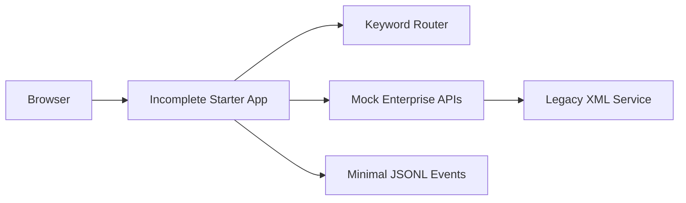

# Starter Architecture

```mermaid
flowchart LR
 U[Browser] --> A[Incomplete Starter App]
 A --> K[Keyword Router]
 A --> M[Mock Enterprise APIs]
 M --> L[Legacy XML Service]
 A --> E[Minimal JSONL Events]
```
Participants should evolve this into a controlled Gemini, orchestration, authorization, adapter, telemetry, tracing, and monitoring architecture.
